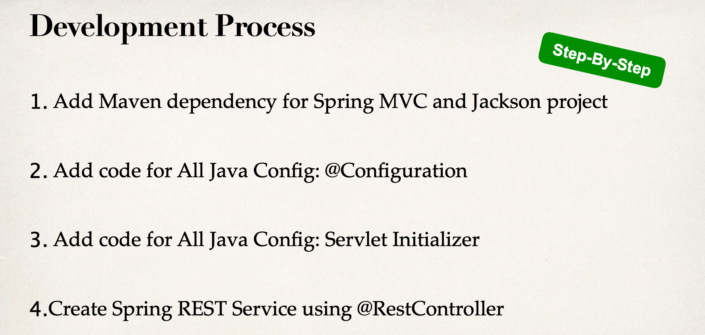
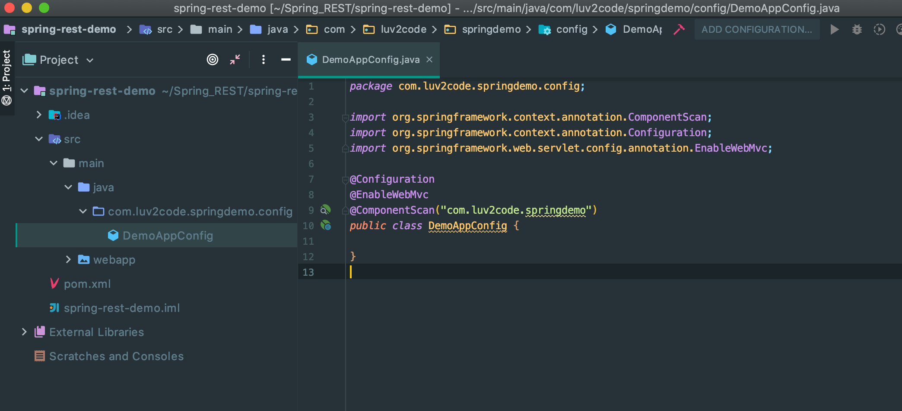
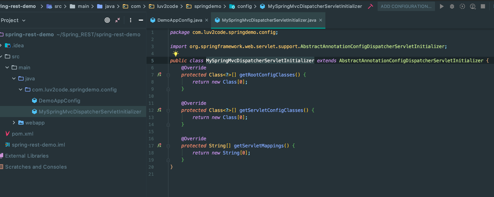
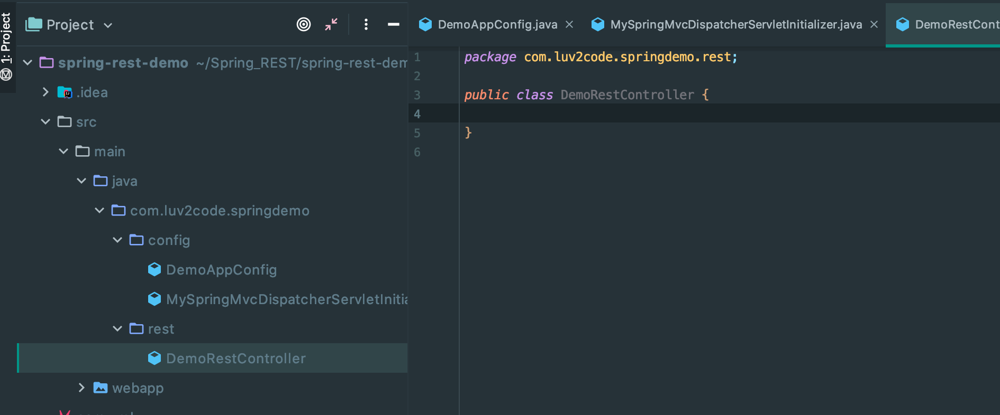
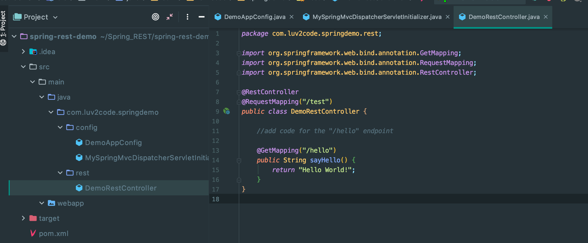
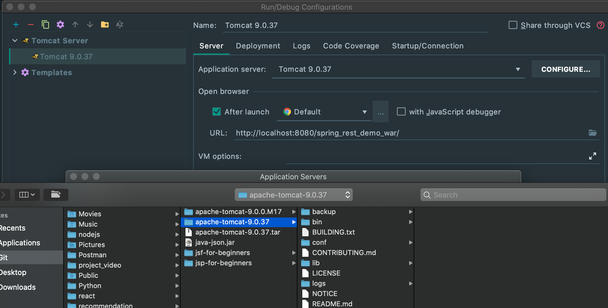
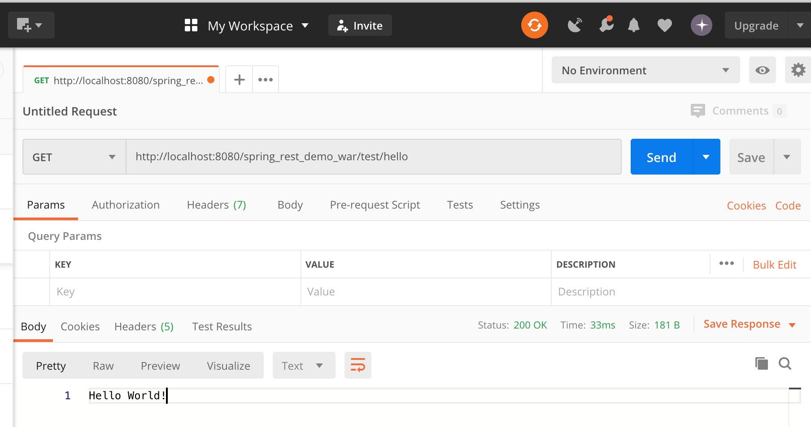

## Spring REST - REST Controller Demo - Set Up Maven Project



- [Download Project](www.luv2code.com/spring-rest-demo)

### Step 1. Maven Dependencies

```xml
	<dependencies>

		<!-- Add Spring MVC and REST support -->
		<dependency>
			<groupId>org.springframework</groupId>
			<artifactId>spring-webmvc</artifactId>
			<version>5.0.5.RELEASE</version>
		</dependency>
		
		<!-- Add Jackson for JSON converters -->
		<dependency>
			<groupId>com.fasterxml.jackson.core</groupId>
			<artifactId>jackson-databind</artifactId>
			<version>2.9.5</version>
		</dependency>

		<!-- Add Servlet support for 
			 Spring's AbstractAnnotationConfigDispatcherServletInitializer -->
		<dependency>
			<groupId>javax.servlet</groupId>
			<artifactId>javax.servlet-api</artifactId>
			<version>3.1.0</version>
		</dependency>

	</dependencies>

	<!-- Support for Maven WAR Plugin -->
	<build>
		<finalName>spring-rest-demo</finalName>
	
		<pluginManagement>
			<plugins>
				<plugin>
				    <groupId>org.apache.maven.plugins</groupId>
				    <artifactId>maven-war-plugin</artifactId>
				    <version>3.2.0</version>					
				</plugin>						
			</plugins>
		</pluginManagement>
	</build>        
				 
	</dependencies>
```


- Add Spring MVC and REST support
- Add Jackson for JSON converters
- Add Servlet support for Spring's `AbstractAnnotationConfigDispatcherServletInitializer`
- Support for Maven WAR Plugin


---

## Set Up All Java Configuration

- Create new package, 



- Step 3: All Java Config: Servlet Initializer

- create a new class `MySpringMvcDispatcherServletInitializer` to implement some methods:



```java
public class MySpringMvcDispatcherServletInitializer extends AbstractAnnotationConfigDispatcherServletInitializer {
    @Override
    protected Class<?>[] getRootConfigClasses() {
        return new Class[0];
    }

    @Override
    protected Class<?>[] getServletConfigClasses() {
        return new Class[]{DemoAppConfig.class};
    }

    @Override
    protected String[] getServletMappings() {
        return new String[]{"/"};
    }
}
```

- create a new package `com.luv2code.springdemo.rest`





- import `Tomcat` server



- run on server: `http://localhost:8080/spring_rest_demo_war/test/hello`

- now copy the URL: `http://localhost:8080/spring_rest_demo_war/test/hello`, then we use **Postman**




