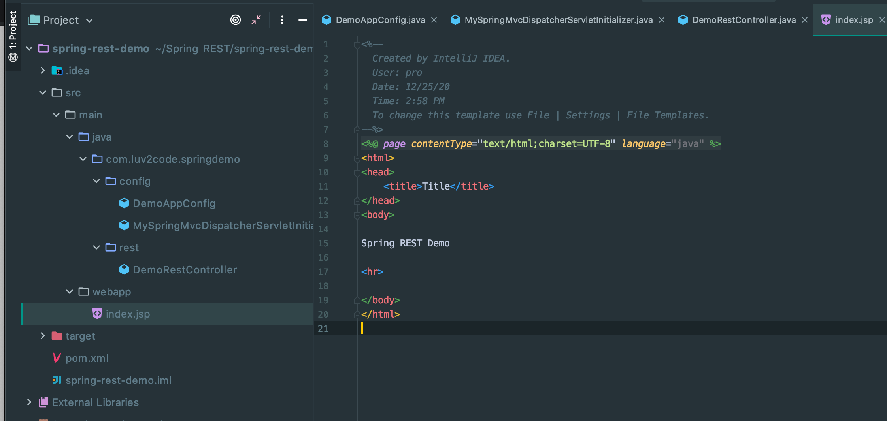
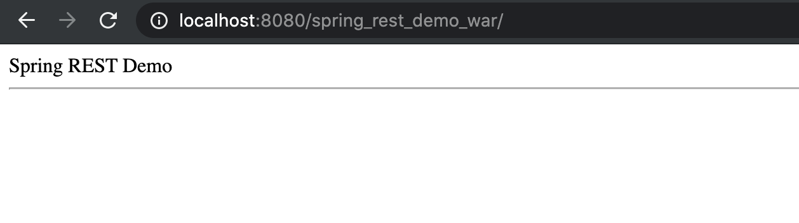
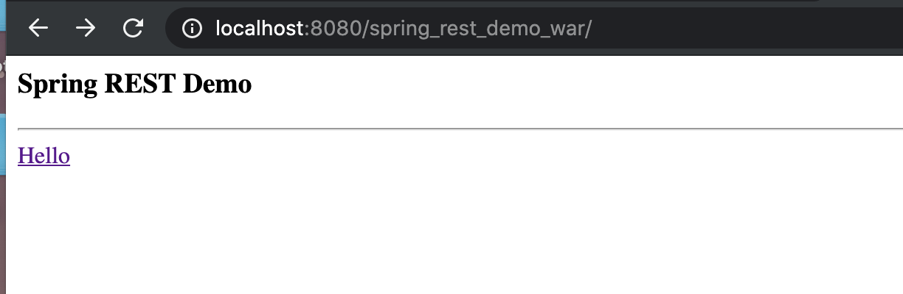
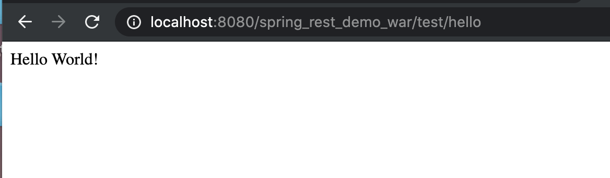

## Spring REST - App Enhancement With Default Page

- we're going to create a new package `webapp`



- Run on Tomcat Server



- update jsp

```jsp
<%@ page contentType="text/html;charset=UTF-8" language="java" %>
<html>
<head>
    <title>Title</title>
</head>
<body>

<h3>Spring REST Demo</h3>

<hr>

<a href="test/hello">Hello</a>

</body>
</html>
```

- rerun on Tomcat



- click `Hello`




