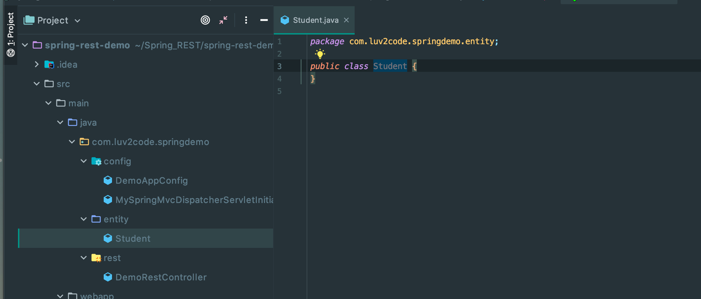
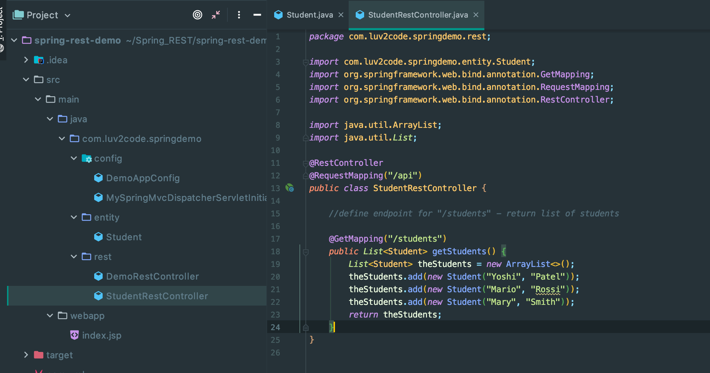
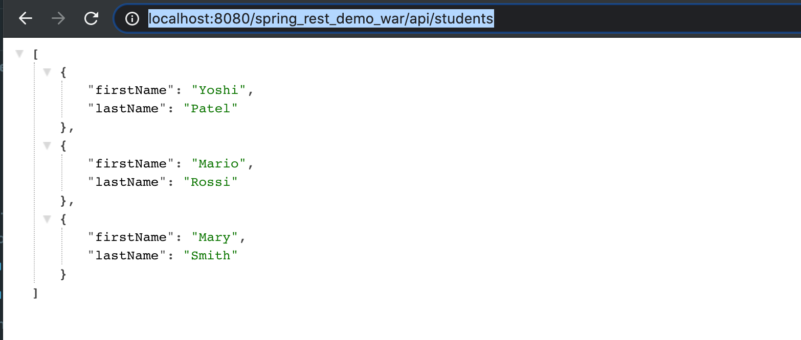
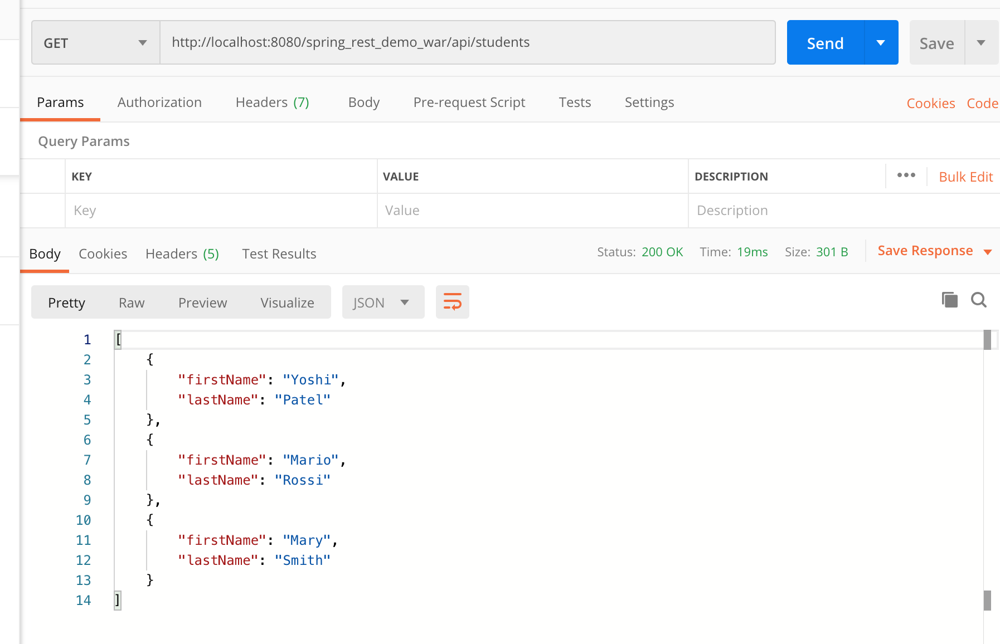

## Retrieve POJOs as JSON - Create POJO

- Create a new Package

---

## Create REST Controller

- now we temporarily use hard code

---

## Test REST Controller

- run on tomcat `http://localhost:8080/spring_rest_demo_war/api/students`

- for Postman:

- we can see that this is a Json object

---

- now update `index.jsp`

