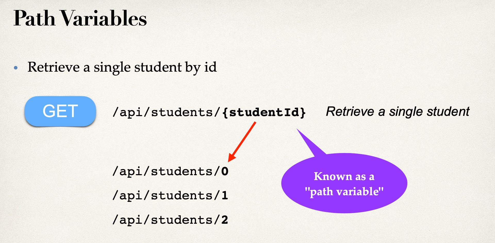
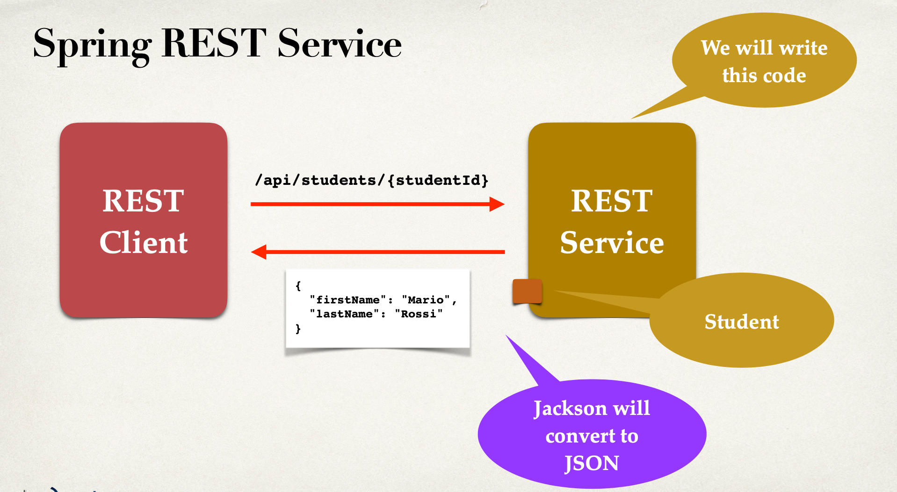
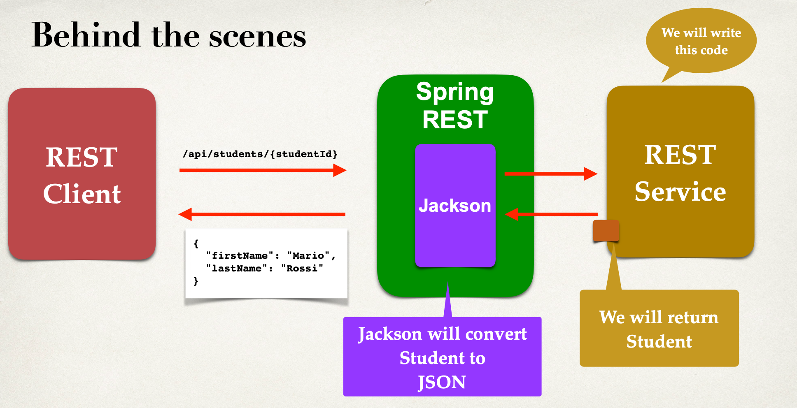
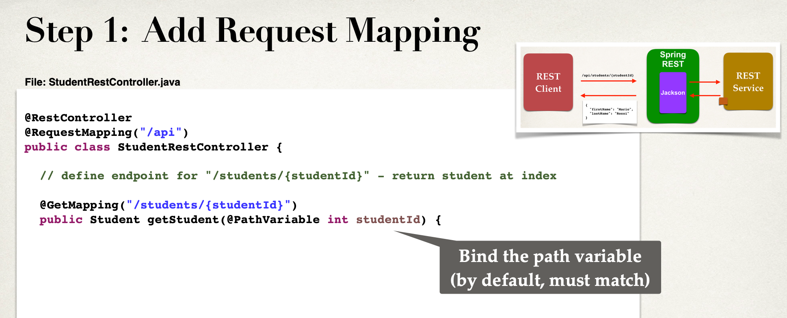
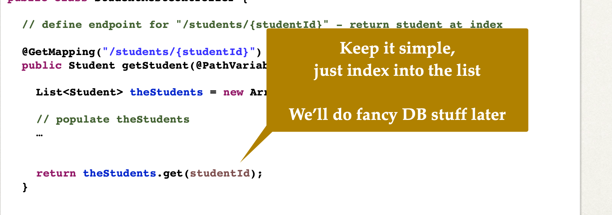
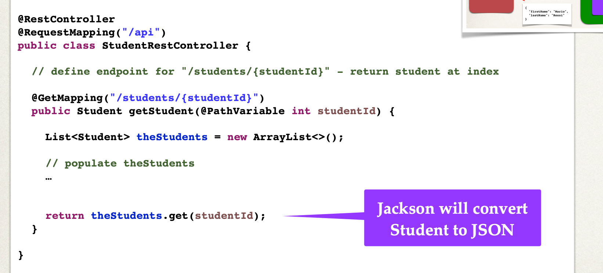
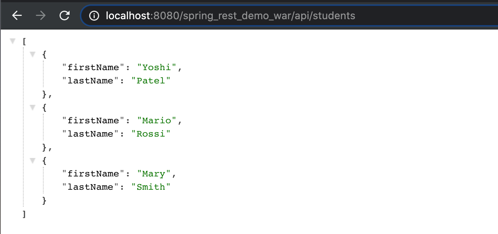
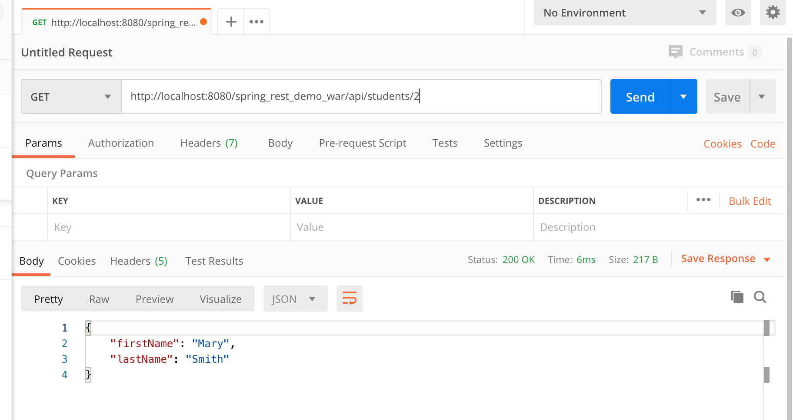

## @PathVariable for REST Endpoints







---

### Development Process







---

## implementation

### Let's refactor our hard codes

- first, Creating list for EVERY request... not good!

```java
@RestController
@RequestMapping("/api")
public class StudentRestController {

    //define endpoint for "/students" - return list of students

    @GetMapping("/students")
    public List<Student> getStudents() {
        List<Student> theStudents = new ArrayList<>();
        theStudents.add(new Student("Yoshi", "Patel"));
        theStudents.add(new Student("Mario", "Rossi"));
        theStudents.add(new Student("Mary", "Smith"));
        return theStudents;
    }
}
```

---

```java
@RestController
@RequestMapping("/api")
public class StudentRestController {

    private List<Student> theStudents;

    //define @PostConstruct to load the student data ... only one!

    @PostConstruct
    public void loadData() {
        theStudents = new ArrayList<>();
        theStudents.add(new Student("Yoshi", "Patel"));
        theStudents.add(new Student("Mario", "Rossi"));
        theStudents.add(new Student("Mary", "Smith"));
    }

    //define endpoint for "/students" - return list of students

    @GetMapping("/students")
    public List<Student> getStudents() {

        return theStudents;
    }
}
```

- let's rerun on tomcat




```java
@RestController
@RequestMapping("/api")
public class StudentRestController {

    private List<Student> theStudents;

    //define @PostConstruct to load the student data ... only one!

    @PostConstruct
    public void loadData() {
        theStudents = new ArrayList<>();
        theStudents.add(new Student("Yoshi", "Patel"));
        theStudents.add(new Student("Mario", "Rossi"));
        theStudents.add(new Student("Mary", "Smith"));
    }

    //define endpoint for "/students" - return list of students

    @GetMapping("/students")
    public List<Student> getStudents() {

        return theStudents;
    }

    //define endpoint for "/students/{studentId}" - return student at index

    @GetMapping("/students/{studentId}")
    public Student getStudent(@PathVariable int studentId) {
        //just index into the list ... keep it simple for now

        return theStudents.get(studentId);
    }
}
```


- let's look at postman




