# 2. What is Inversion of Control?

-  Inversion of Control (IoC)
        
        -  The approach of outsourcing the construction and management of objects

- Coding Scenario

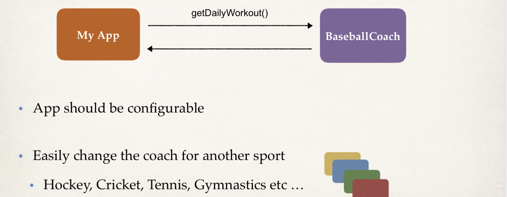
---

- Code Demo
    
    - MyApp.java : main method
    
    - BaseballCoach.java
    
    - Coach.java: interface after refactoring
    
    - TrackCoach.java

- create a package `com.luv2code.springdemo`

- create a new class: BaseballCoach

```java
package com.luv2code.springdemo;
public class BaseBallCoach {
    public String getDailyWorkout(){
        return "Spend 30 minutes on batting practice";
    }
}
```

- create `MyApp`, this is a main method

```java
public class MyApp {
    public static void main(String[] args) {
        // create the object
        // Coach theCoach = new BaseballCoach();
        BaseBallCoach theCoach = new BaseBallCoach();

        // use the object
        System.out.println(theCoach.getDailyWorkout());
    }
}
```

- run the main method

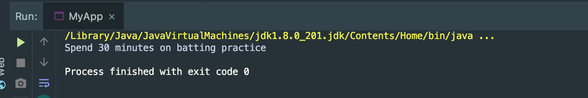
---

- every coach is going to have a method called `getDailyWorkout`

:star: Refactoring code: Create an Interface

```java
public interface Coach {
    public String getDailyWorkout();
}
```

- Refactoring code: Implementing an Interface

```java
public class BaseBallCoach implements Coach{
    @Override
    public String getDailyWorkout(){
        return "Spend 30 minutes on batting practice";
    }
}
```

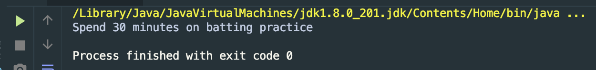

- get the same result

---

- create a TrachCoach

```java
public class TrachCoach implements Coach{
    @Override
    public String getDailyWorkout() {
        return "Run a hard 5k";
    }
}
```

- MyApp

```java
public class MyApp {
    public static void main(String[] args) {
        Coach theCoach = new TrachCoach();
        // use the object
        System.out.println(theCoach.getDailyWorkout());
    }
}
```

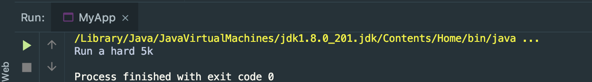
---


:star: so far, `Coach theCoach = new TrachCoach();` is still hardcoded :-(

---

- `Ideal Solution`

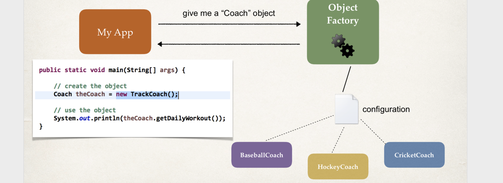
---

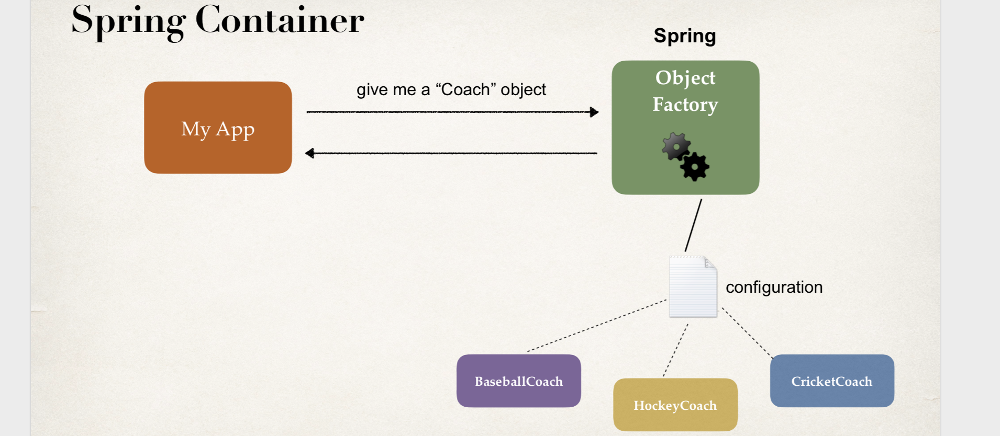
---

- Spring Container
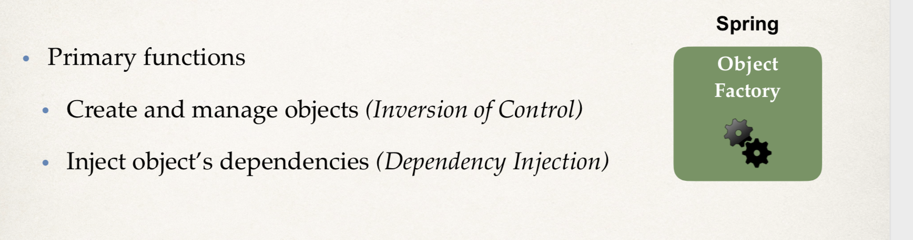
---

- Configuring Spring Container

:star: XML configuration file (legacy, but most legacy apps still use this)

:star: Java Annotations (modern)

:star: Java Source Code (modern)
---

### `Spring Development Process`

1. Configure your Spring Beans

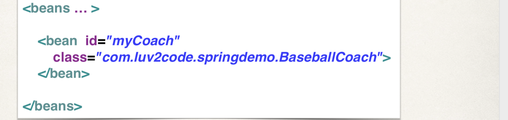
---

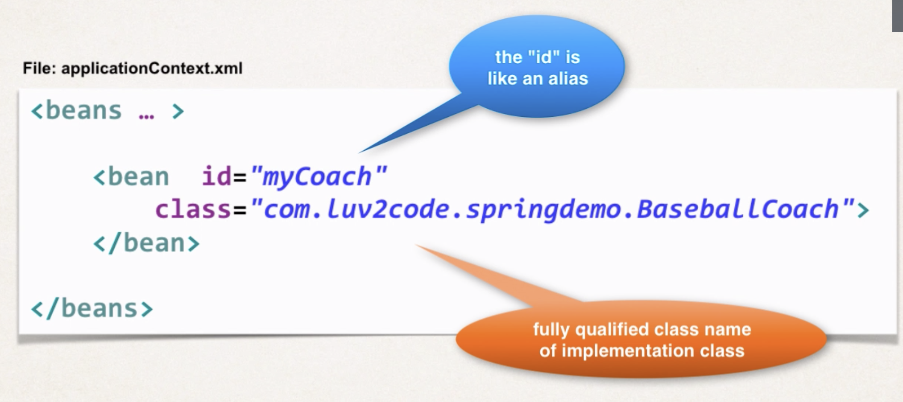
---


2. Create a Spring Container

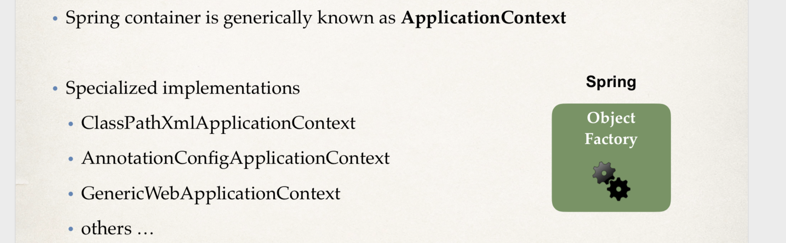
---

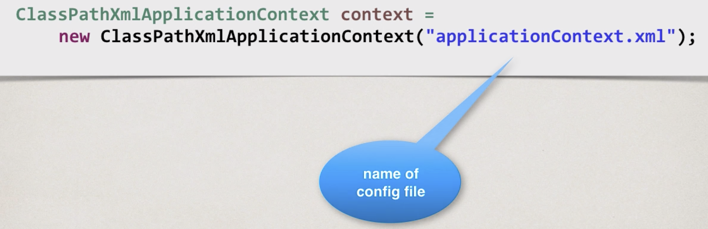
---

3. Retrieve Beans from Spring Container

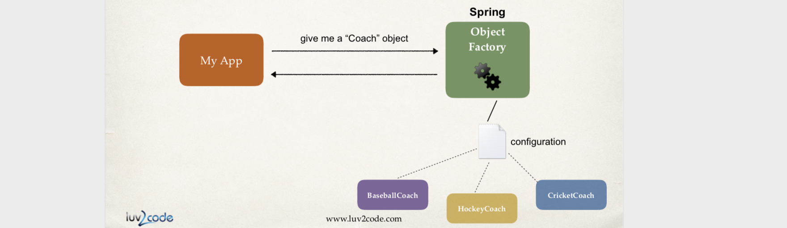
---

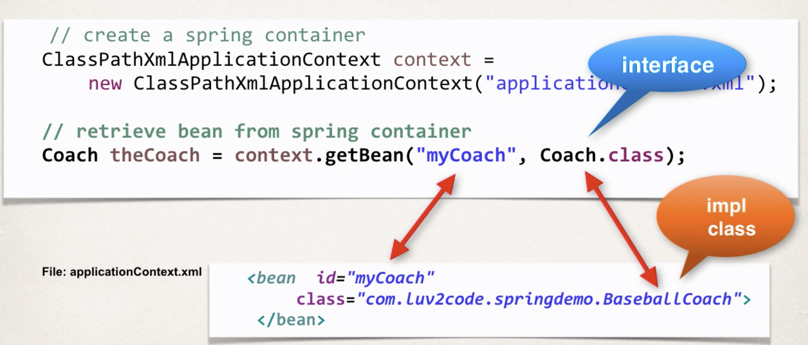
---

---
### `What is a Spring Bean?`

:star: A "Spring Bean" is simply a Java object.

- When Java objects are created by the Spring Container, then Spring refers to them as "Spring Beans".

- Spring Beans are created from normal Java classes .... just like Java objects.
---

### `Spring Inversion of Control`

- copy a `applicationContext.xml` into `com.luv2code.srpingdemo` package

```xml
<?xml version="1.0" encoding="UTF-8"?>
<beans xmlns="http://www.springframework.org/schema/beans"
    xmlns:xsi="http://www.w3.org/2001/XMLSchema-instance" 
    xmlns:context="http://www.springframework.org/schema/context"
    xsi:schemaLocation="http://www.springframework.org/schema/beans
    http://www.springframework.org/schema/beans/spring-beans.xsd
    http://www.springframework.org/schema/context
    http://www.springframework.org/schema/context/spring-context.xsd">

    <!-- Define your beans here -->
    <bean id="myCoach"
            class="com.luv2code.springdemo.TrachCoach">
    </bean>
</beans>
```

:star: `id="myCoach" class="com.luv2code.springdemo.TrachCoach"`

---

- create a class `HelloSpringApp`.java

```java
public class HelloSpringApp {
    public static void main(String[] args) {
        //load the spring configuration file
        ClassPathXmlApplicationContext context = 
                new ClassPathXmlApplicationContext("applicationContext.xml");
        
        //retrieve bean from spring container
        Coach theCoach = context.getBean("myCoach", Coach.class);
        
        //call methods on the bean
        System.out.println(theCoach.getDailyWorkout());
        
        //close the context
        context.close();
    }
}
```

- run the `HelloSpringApp`

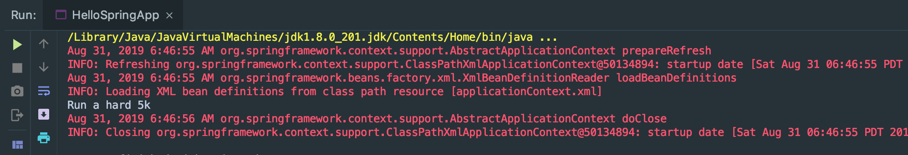

---

- so we change the bean 

```xml
      <bean id="myCoach"
            class="com.luv2code.springdemo.BaseballCoach">
      </bean>
```

- we change the `TrackCoach` to `BaseballCoah`

- run the main method:


---

### `Why do we specify the Coach interface in getBean()?`

`Coach theCoach = context.getBean("myCoach", Coach.class); `

:star: When we pass the interface to the method, behind the scenes Spring will cast the object for you.


### `Practice Activity #1 - Inversion of Control with XML Configuration`

1. Define a new implementation for the Coach interface. You can use whatever sport you would like.

2. Reference your new implementation in the Spring config file.

3. Test your application to verify you are retrieving information from your new Coach implementation.

- create a `BasketballCoach`

```java

public class BasketballCoach implements Coach {
    @Override
    public String getDailyWorkout(){
        return "Spend 1 hour on shooting basketball";
    }
}
```
- run the `HelloSpringApp.java`'s main method:

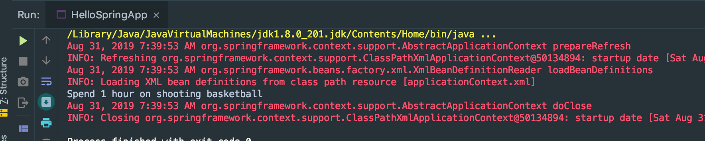