# 10. Running SpringBoot from command line

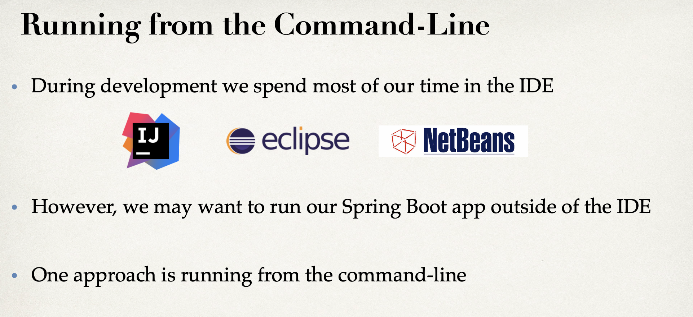

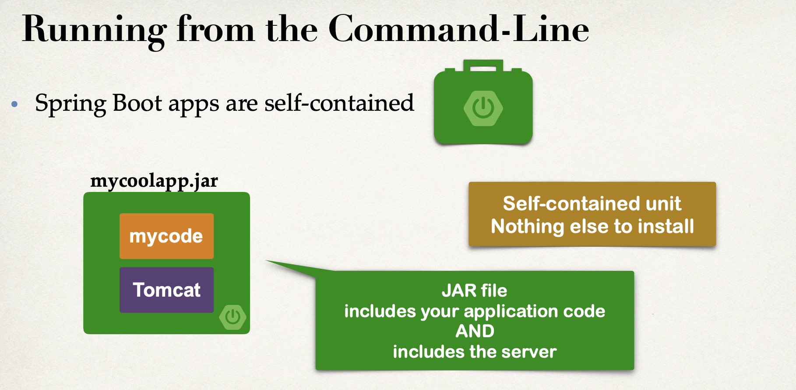

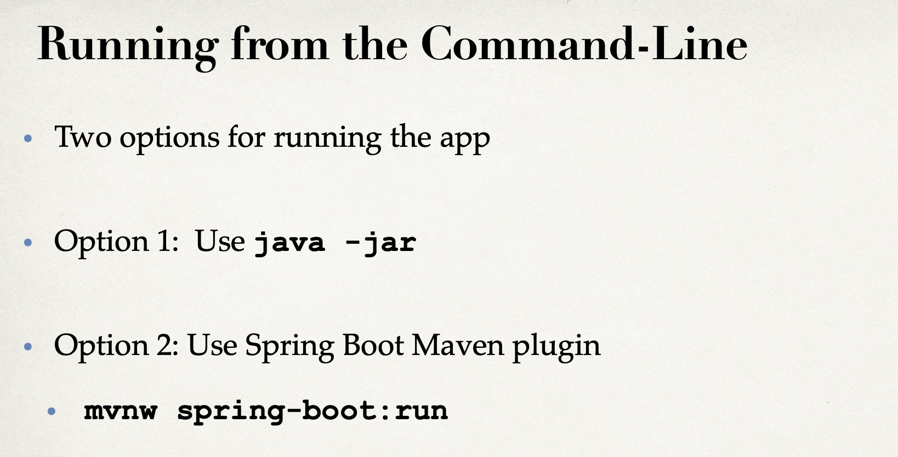

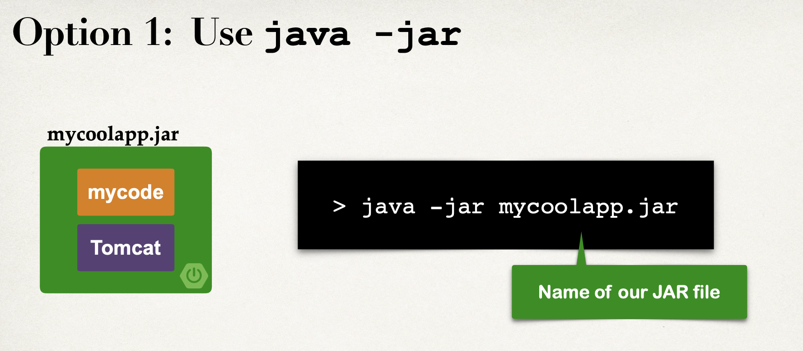

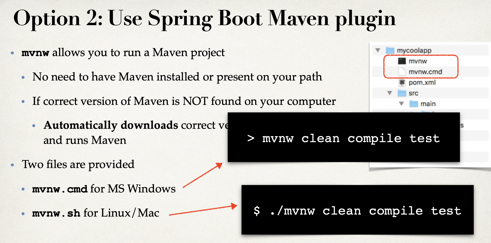

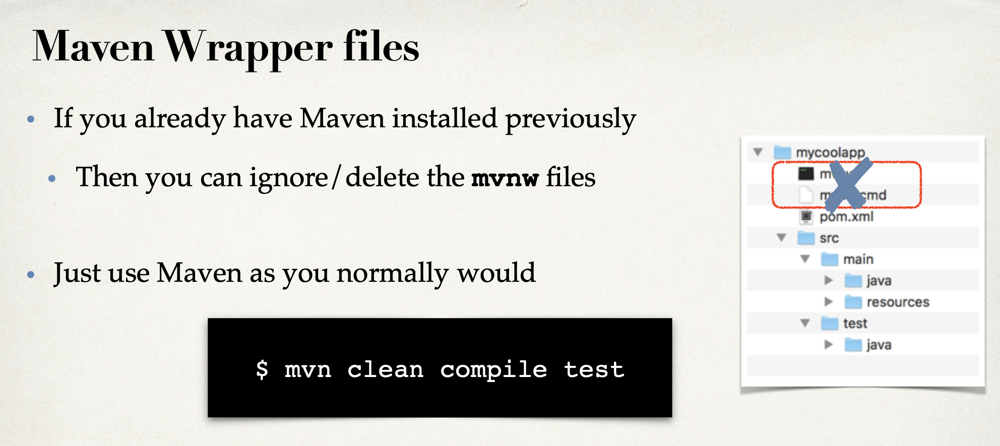

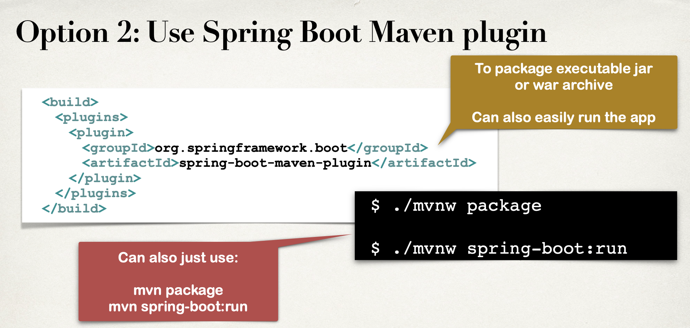

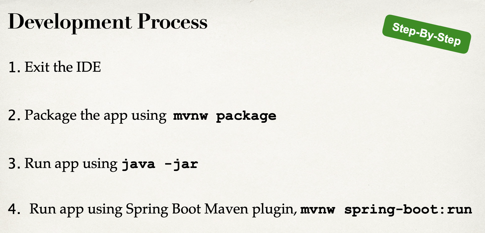

---

### Let's delete actuator and security from pom.xml

- exit the IDE

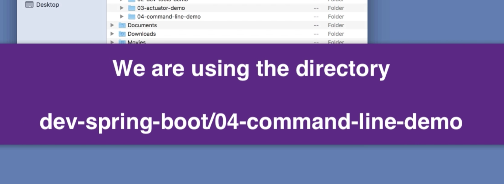

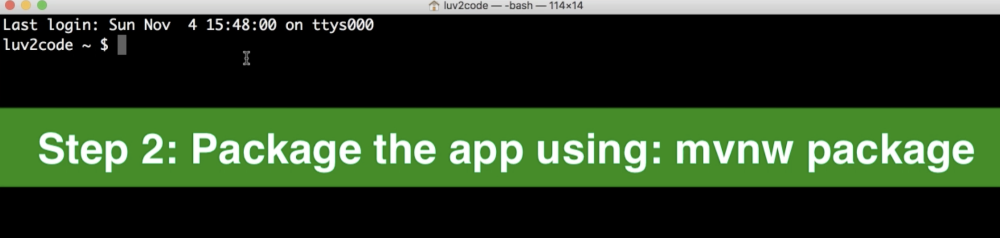

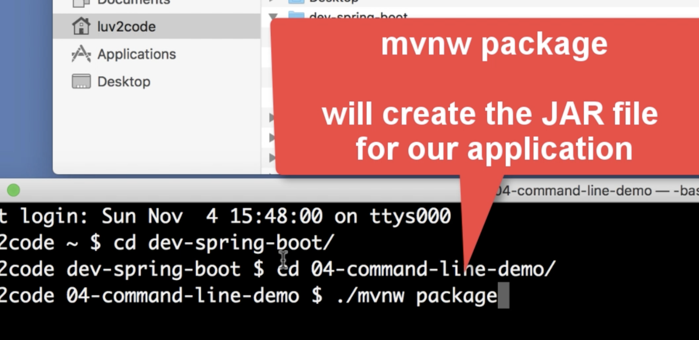

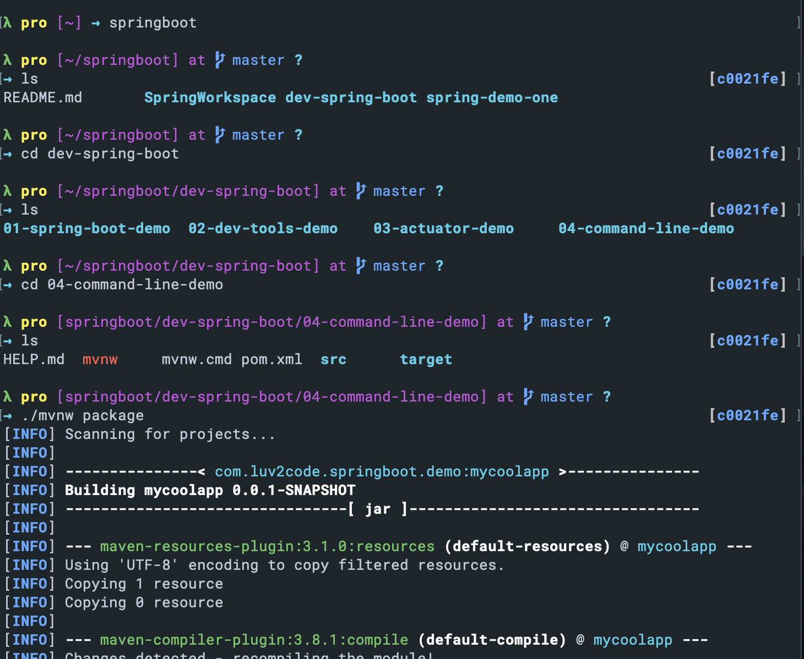

- run `./mvnw package`

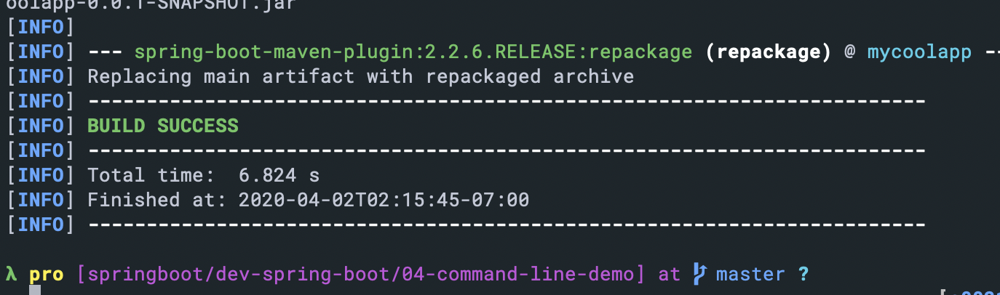

- we see `BUILD SUCCESS`

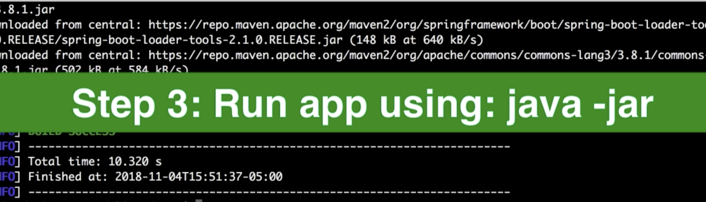

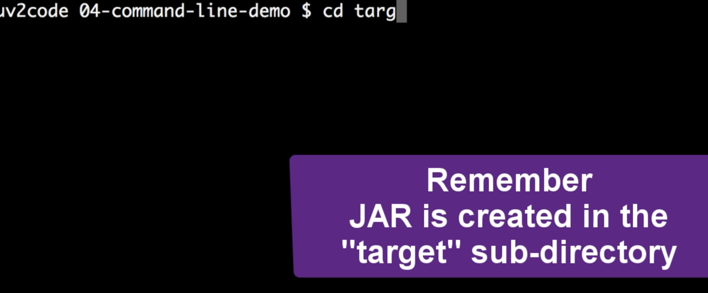

- `cd target`

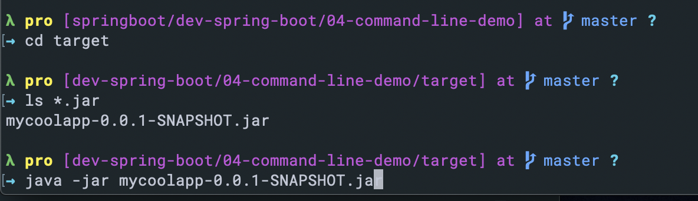

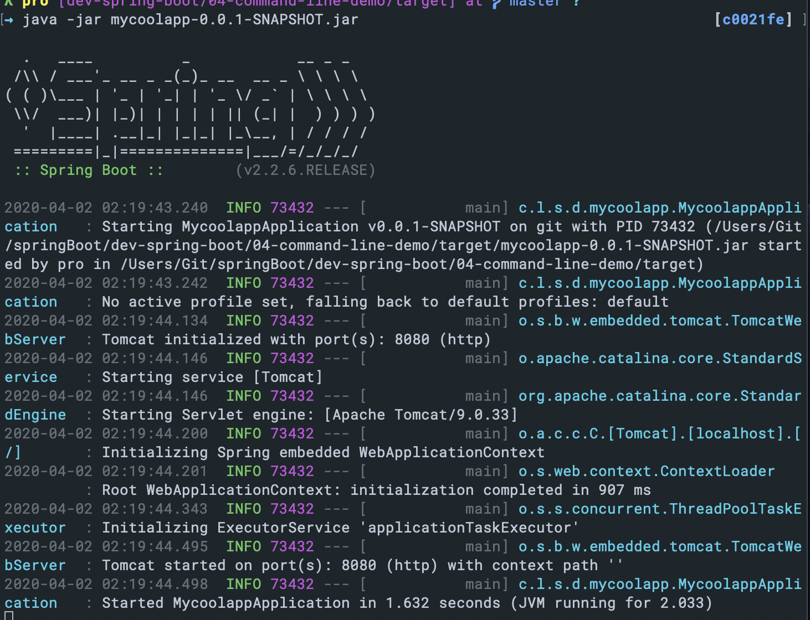

- so our springboot app run successfully

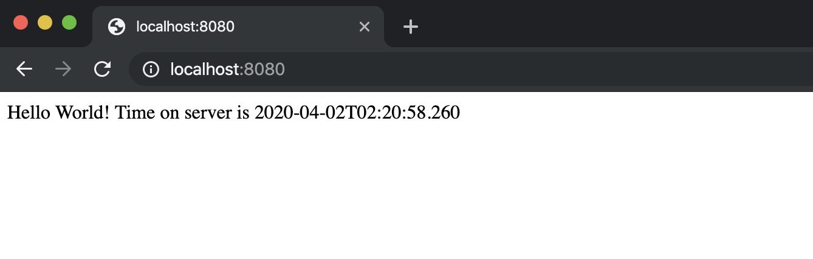

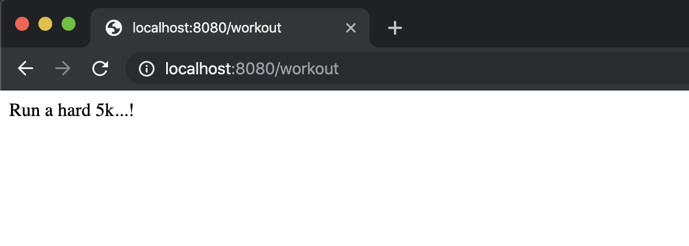

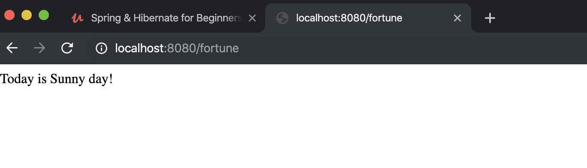
---

## Run app using spring boot maven plugin

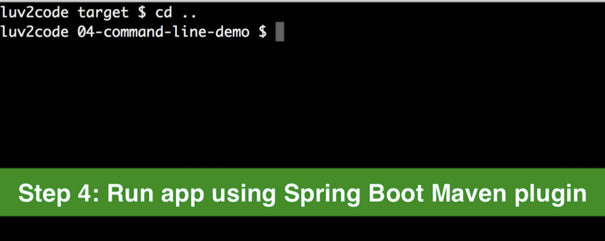

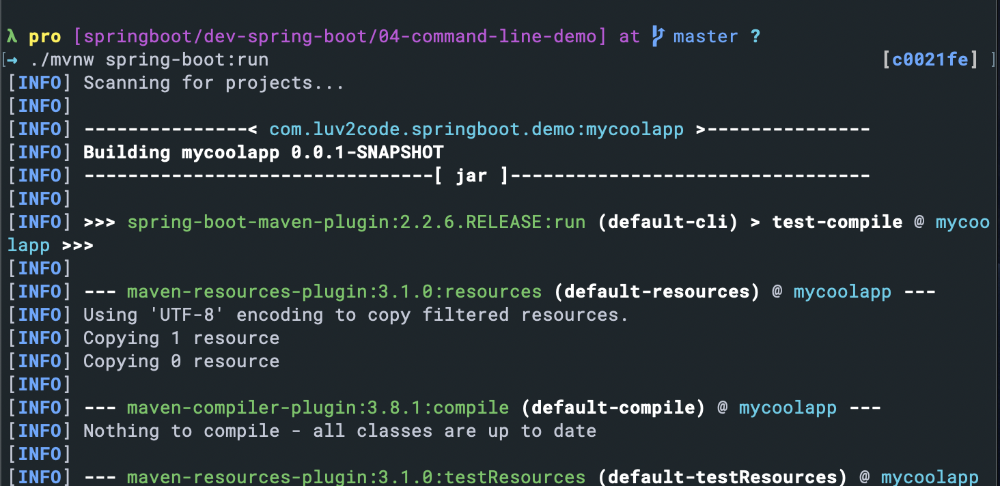

- enter localhost:8080 again

- working again!

- this point, we run springboot app from command line, no need for IDE, and 
  also no need to have any of the servers installed because our springboot app
  is self contained.

