# 2. Create a Project with SpringBoot initializr

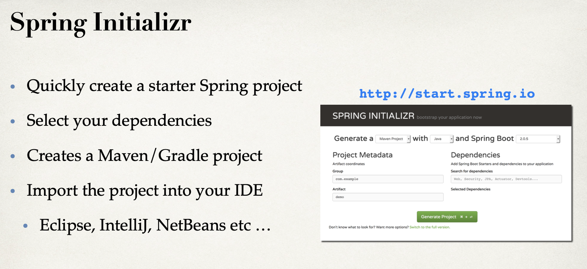
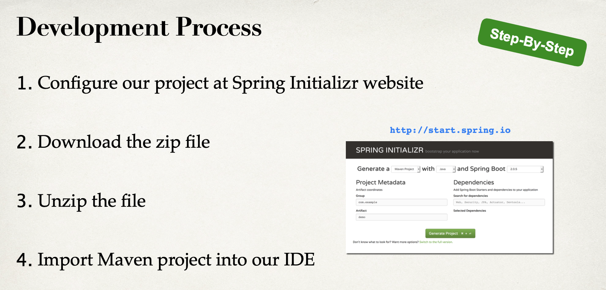

## input `https://start.spring.io/`

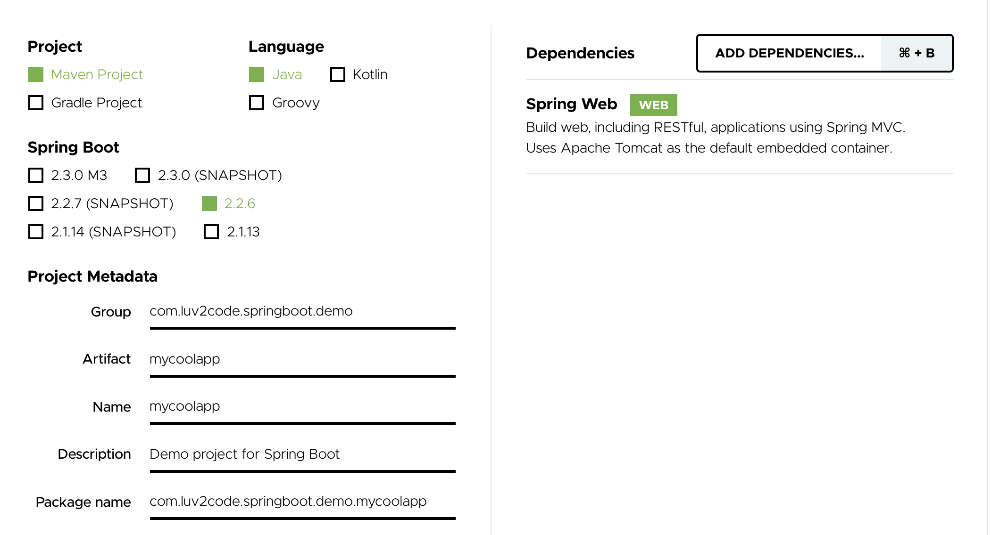

- note: add `Spring Web`

- click `GENERATE` button to create a web project

- then we can download the `mycoolapp.zip`

- unzip this .zip file

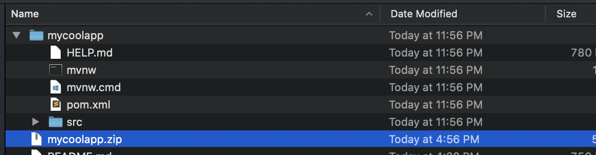

---

## create a folder named `dev-spring-boot`, paste mycoolapp into this folder

- import mave project

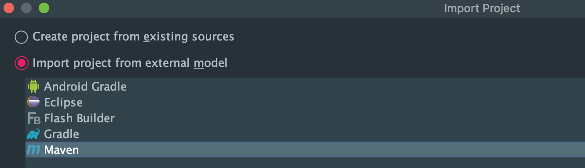

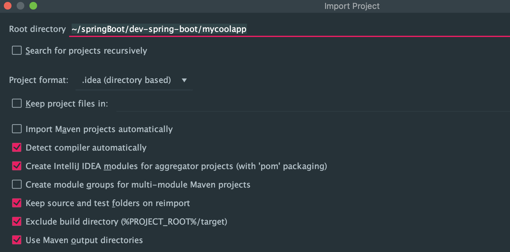

- click next

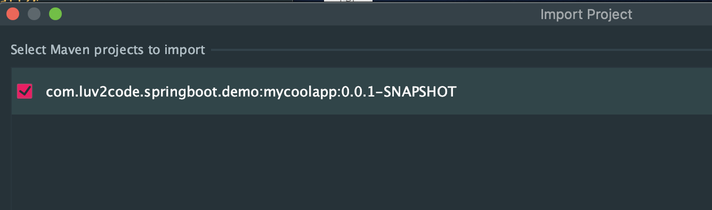

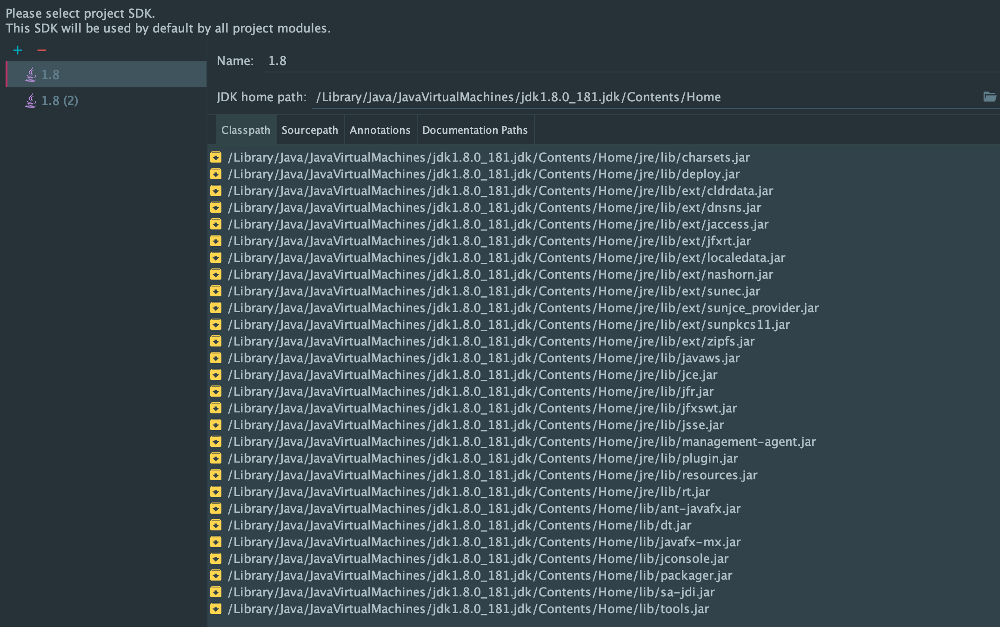

## if we use Eclipse, we need to fix it, but for intellij don't need

- it's different from jsp + servlet

- springboot just need to run application

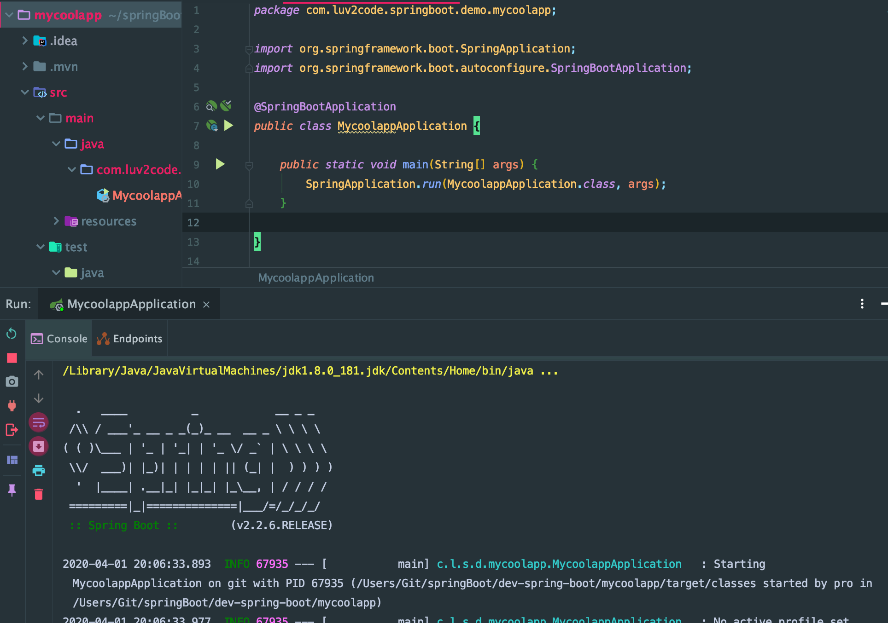

- open `localhost:8080`

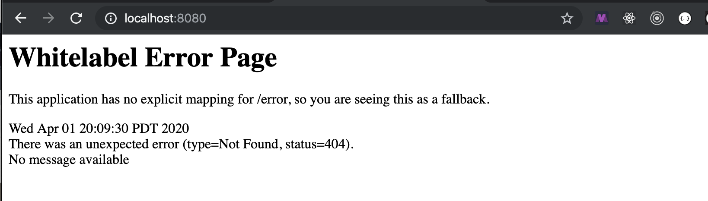

- here is ugly error

---

## Developing a REST API Controller with Spring Boot

- create a new package 

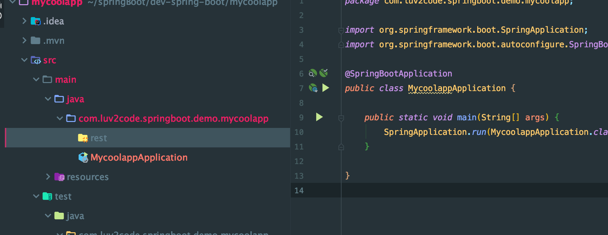

- create a new class `FunRestController` inside this folder

- building REST controller we start with the annotation

- improve the FunRestController.java

```java
package com.luv2code.springboot.demo.mycoolapp.rest;

import org.springframework.web.bind.annotation.GetMapping;
import org.springframework.web.bind.annotation.RestController;

import java.time.LocalDateTime;

@RestController
public class FunRestController {

    // expose "/" that return "Hello World"

    @GetMapping("/")
    public String sayHello(){
        return "Hello World! Time on server is " + LocalDateTime.now(); //Current time stamp
    }
}
```

- back to `MycoolappApplication`

- run again

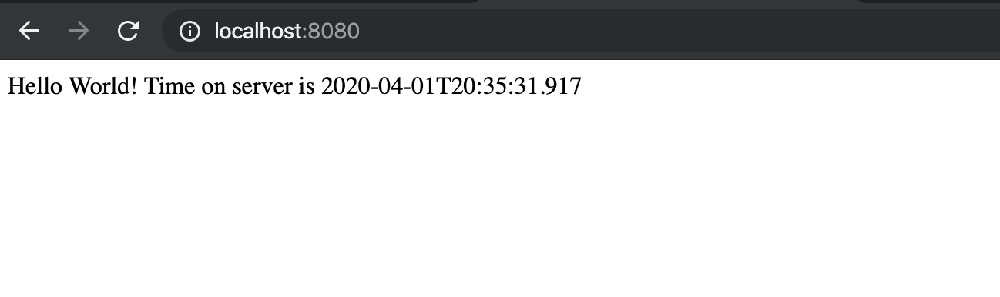


- springboot solution made it easier to get started with spring development

- so use that spring initializer to help us set up our project really quickly

- we don't need to do any xml configuration and any java configuration

