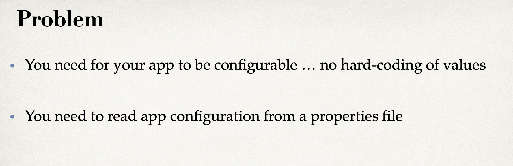
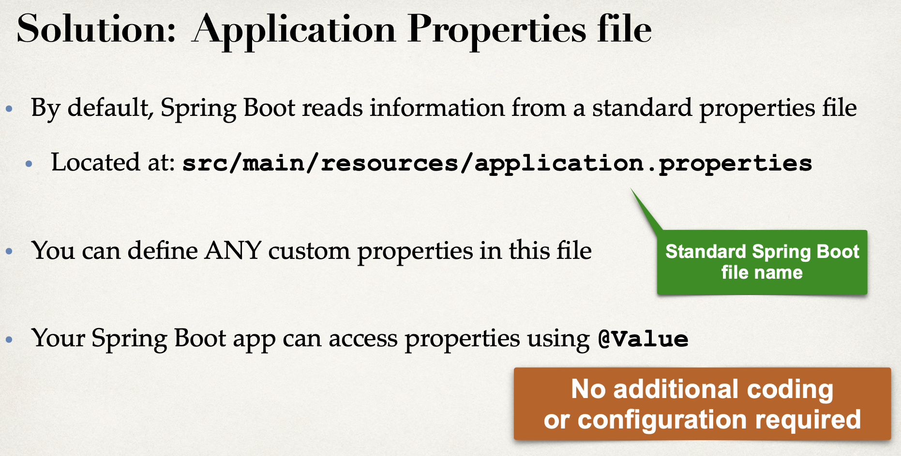
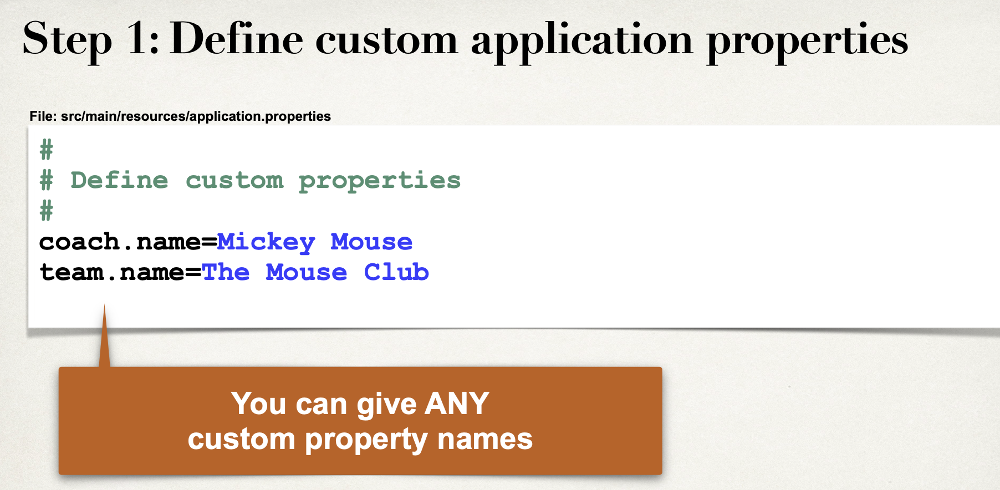
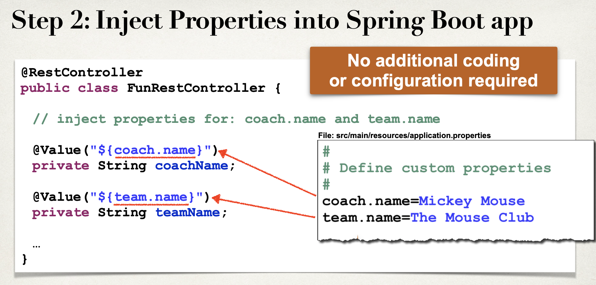
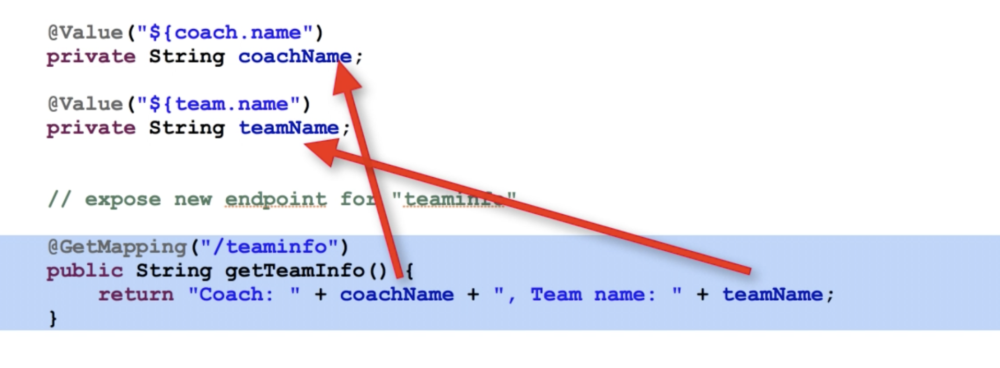

# 11. Injecting Custom App properties










- update `resources/application.properties`

```json
#
# Define my crazy properties
#
coach.name = Mickey mouse
tem.name = The Mouse Club
```



- update FunRestController

```java
@RestController
public class FunRestController {

    // inject properties for: coach.name and team.name

    @Value("${coach.name}")
    private String coachName;

    @Value("${team.name}")
    private String teamName;

    // expose new endpoint for "teamInfo"
    @GetMapping("/teamInfo")
    public String getTeamInfo(){
        return "Coach: " + coachName + ", Team name: " + teamName;
    }


    // expose "/" that return "Hello World"
    @GetMapping("/")
    public String sayHello(){
        return "Hello World! Time on server is " + LocalDateTime.now(); //Current time stamp
    }

    //expose a new endpoint for "workout"
    @GetMapping("/workout")
    public String getDailyWorkout(){
        return "Run a hard 5k...!";
    }

    //expose a new endpoint for "fortune"
    @GetMapping("/fortune")
    public String getDailyFortune(){
        return "Today is Sunny day!";
    }
}
```


