# 9. Applying Security to Actuator endpoints


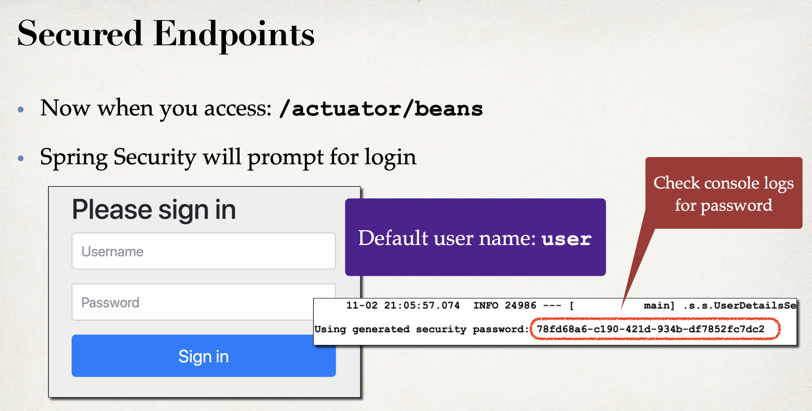

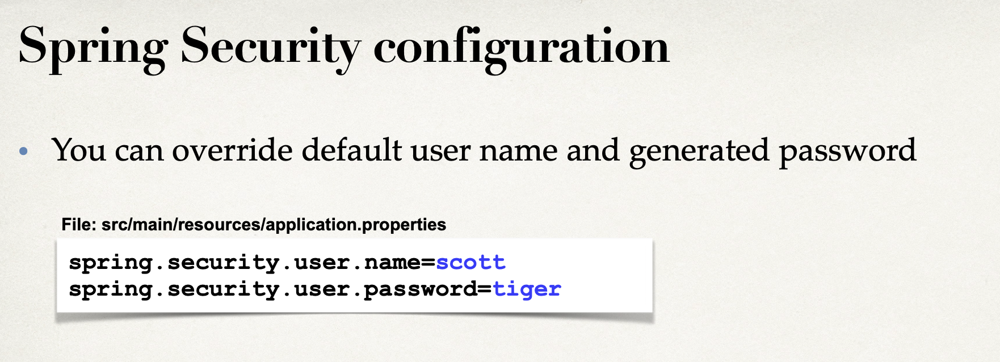

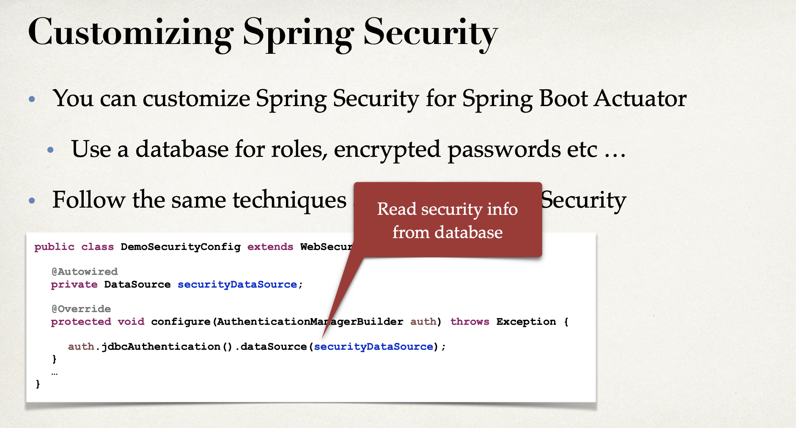

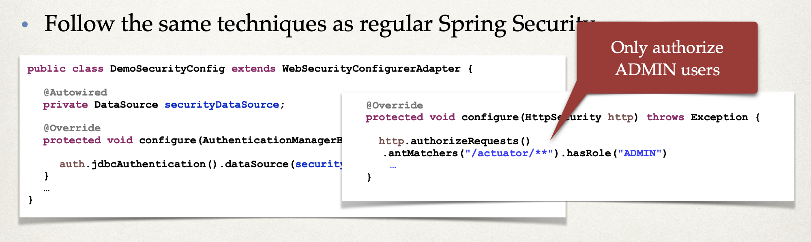

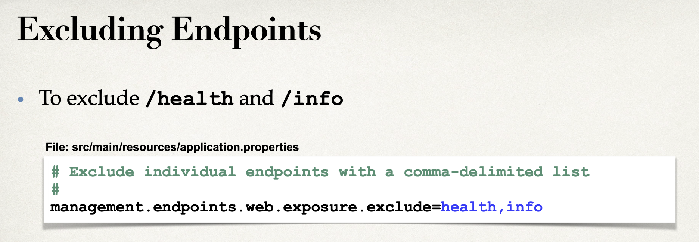

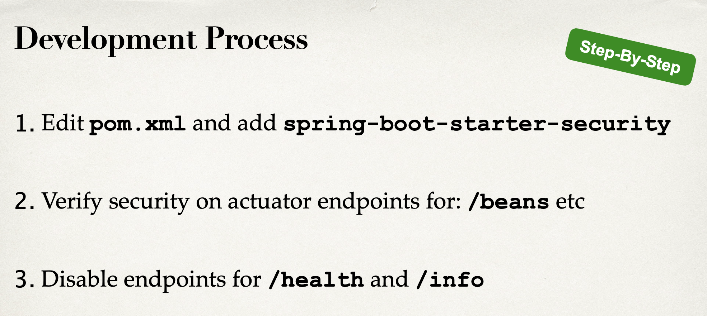

---

## Step1: Edit pom.xml and add spring-boot-starter-security

- update pom.xml

```xml
		<!-- ADD SUPPORT FOR AUTOMATIC RELOADING -->
		<dependency>
			<groupId>org.springframework.boot</groupId>
			<artifactId>spring-boot-devtools</artifactId>
		</dependency>

		<!-- ADD SUPPORT FOR SPRING BOOT ACTUATOR -->
		<dependency>
			<groupId>org.springframework.boot</groupId>
			<artifactId>spring-boot-starter-actuator</artifactId>
		</dependency>

		<!-- ADD SUPPORT FOR SPRING BOOT SECURITY -->
		<dependency>
			<groupId>org.springframework.boot</groupId>
			<artifactId>spring-boot-starter-security</artifactId>
		</dependency>
	</dependencies>

```

- restart the app

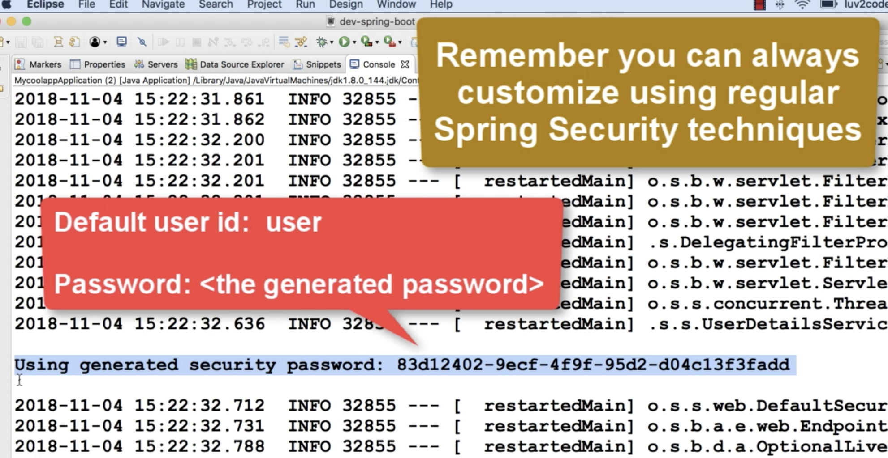

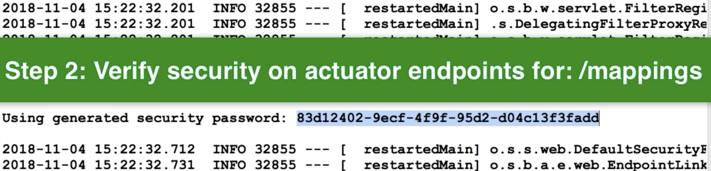

- refresh the page

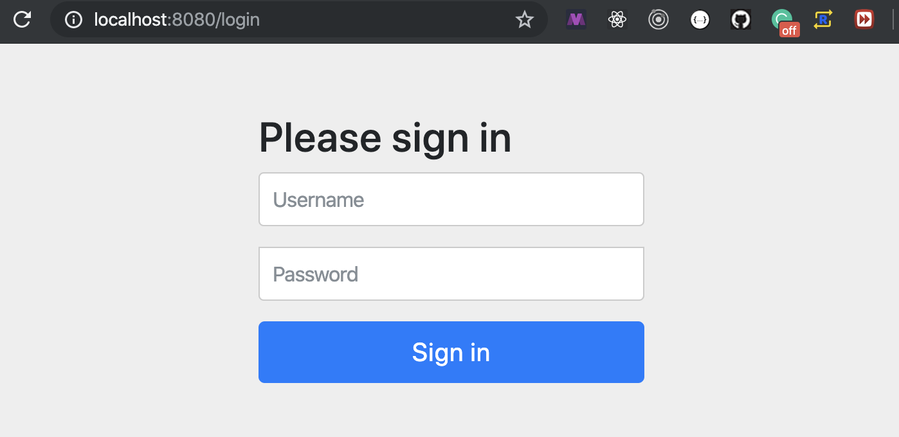

- input Username: user

- input password: 9ecb5b84-ced8-4f2f-80a3-394776cda710

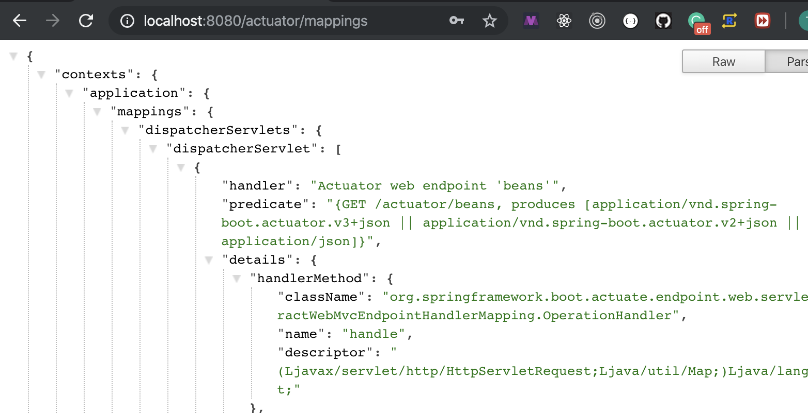

- now input http://localhost:8080/actuator/info

- input http://localhost:8080/actuator/health

- update `resources/application.properties`

```json
info.app.name = My Super Cool App
info.app.description = A crazy fun app, yoohoo!
info.app.version = 1.0.0

# Use wildcard "*" to expose all endpoints
# Can also expose individual endpoints with a comma-delimited list
#
management.endpoints.web.exposure.include=*

# Exclude individual endpoints with a comma-delimited list
management.endpoints.web.exposure.exclude=health,info
```

- now enter http://localhost:8080/actuator/info

- input http://localhost:8080/actuator/health

- we see 404 error

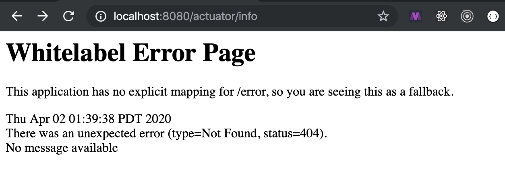

- this is good, since we disable /health or /info


